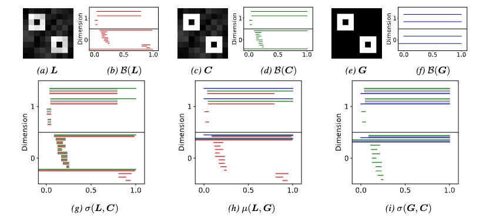

Deep-learning models achieve high performance on various biomedical prediction tasks but often rely on extensive annotated datasets. Especially in biomedicine, such datasets are frequently unavailable due to the difficulty and cost of annotation. Self-supervised pre-training methods, such as the masked autoencoder (MAE) [1], have emerged as a promising way to leverage unlabeled data, reducing the need for large annotated datasets. However, these methods often struggle to preserve fine-grained structures, such as alveoli or pulmonary vessels in lung CT scans, which are critical for downstream applications such as disease classification.

This Master's thesis focuses on developing novel pre-training strategies to preserve these fine-grained structures in medical images. Specifically, we aim to incorporate methods from digital topology to capture and maintain topological information during image reconstruction. Our approach builds on recent advances in topological loss functions for training segmentation networks [2,3,4].

Note that we also offer other projects in the field of topology-preserving image segmentation. For more information, see our profiles.
 

 

## Your qualifications:

We are looking for a highly motivated Master’s student in Computer Science, Physics, Engineering or Mathematics. Your goal is to explore how existing topological loss functions can be used for pre-training and compare them to alternative approaches. You will be working together with Alex and Laurin, two research scientist at TU Munich, as well as Johannes, an appointed assistant professor at Cornell University. Supervision will be provided by Prof. Daniel Rueckert.  Importantly, we aim to publish the results of this work, with you, in a follow up study at a high-impact machine learning conference or in an academic journal. 

**Requirements:**

1. Strong motivation and interest in machine learning.
2. Advanced programming skills in C++, Python or C.
3. Enthusiasm for teamwork and interdisciplinary research.

 

## What we offer:

-   An exciting research project with many possibilities to bring in your own ideas.
-   Close supervision and access to state-of-the-art computer hardware.
-   The chance to work in a team of highly qualified experts in machine learning, computer vision, and deep learning.

 

## How to apply:

Just send an email to a.berger@tum.de, laurin.lux@tum.de, and jpaetzold@med.cornell.edu, with a short CV and your grade report. We promise to get back to you within days.

 

 

## References:

[1] He, K., Chen, X., Xie, S., Li, Y., Dollár, P., & Girshick, R. (2022). Masked autoencoders are scalable vision learners. In Proceedings of the IEEE/CVF conference on computer vision and pattern recognition (pp. 16000-16009).

[2] Lux, L., Berger, A. H., Weers, A., Stucki, N., Rueckert, D., Bauer, U., & Paetzold, J. C. (2024). Topograph: An efficient Graph-Based Framework for Strictly Topology Preserving Image Segmentation. arXiv preprint arXiv:2411.03228.

[3] Stucki, N., Paetzold, J. C., Shit, S., Menze, B., & Bauer, U. (2023, July). Topologically faithful image segmentation via induced matching of persistence barcodes. In International Conference on Machine Learning (pp. 32698-32727). PMLR.

[4] Stucki, N., Bürgin, V., Paetzold, J. C., & Bauer, U. (2024). Efficient Betti Matching Enables Topology-Aware 3D Segmentation via Persistent Homology. arXiv preprint arXiv:2407.04683.

 

