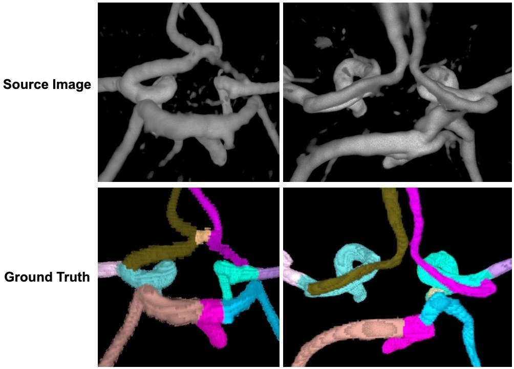

Topological correctness, i.e., the preservation of structural integrity and specific characteristics of shape, is a fundamental requirement for medical imaging tasks, such as neuron or vessel segmentation. However, most networks are trained using pixel-wise loss functions such as Dice, neglecting topological accuracy. Recently, significant methodological advancements have applied well-founded concepts from algebraic topology to topologically-accurate binary segmentation [1,2,3,4]. However, these approaches have been underexplored in multi-class segmentation scenarios, where topological errors are common. Especially the topological interactions between multiple classes are often disregarded.

This project focuses on developing novel image segmentation methods that maintain topological-accuracy in complex multiclass scenarios. Your approach will build on recent advances in topological loss functions for training segmentation networks [1,3,4] and will be applied to highly relevant medical tasks, such as cerebrovascular segmentation. 

Note that we also offer other projects in the field of topology-preserving image segmentation. For more information, see our profiles.
 

 

## Methodology

1. Review on the current state-of-the-art techniques for topologically-accurate image segmentation.
2. Identification of relevant medical multiclass segmentation tasks.
3. Extension of a topology-preserving image segmentation method to account for complex multiclass interactions.
4. Comparison to existing baseline methods in terms of pixel-wise, overlap-based, and topological accuracy.
5. Preparation and submission of a peer-reviewed publication.

## Your qualifications:

We are looking for a highly motivated student in Computer Science, Physics, Engineering or Mathematics. Your goal is to develop a topologically-accurate image segmentation method with special regard to multiclass interactions and compare them to alternative approaches. You will be working together with Alex and Laurin, two research scientist at TU Munich, as well as Johannes, an appointed assistant professor at Cornell University. Supervision will be provided by Prof. Daniel Rueckert. Importantly, we aim to publish the results of this work, with you, in a follow up study at a high-impact machine learning conference or in an academic journal. 

**Requirements:**

1. Strong motivation and interest in machine learning.
2. Strong academic record (e.g. high GPA in current and previous studies).
3. Advanced programming skills in C++, Python or C.
4. Enthusiasm for teamwork and interdisciplinary research.

 

## What we offer:

-   An exciting research project with many possibilities to bring in your own ideas.
-   Close supervision and access to state-of-the-art computer hardware.
-   Hands-on experience with state-of-the-art machine learning architectures.
-   The chance to work in a collaborative (TUM and Cornell) team of highly qualified experts in machine learning, computer vision, and deep learning.

 

## How to apply:

Just send an email to a.berger@tum.de, laurin.lux@tum.de, and jpaetzold@med.cornell.edu, with a short CV and your grade report. We promise to get back to you within days.

 

## References:

[1] Lux, L., Berger, A. H., Weers, A., Stucki, N., Rueckert, D., Bauer, U., & Paetzold, J. C. (2024). Topograph: An efficient Graph-Based Framework for Strictly Topology Preserving Image Segmentation. arXiv preprint arXiv:2411.03228.

[2] Berger, A. H., Lux, L., Stucki N, Bürgin, V., Shit S., Banaszak A., Rueckert D., Bauer U., Paetzold J. C. (2024) Topologically faithful multi-class segmentation in medical images. International Conference on Medical Image Computing and Computer-Assisted Intervention.

[3] Stucki, N., Paetzold, J. C., Shit, S., Menze, B., & Bauer, U. (2023, July). Topologically faithful image segmentation via induced matching of persistence barcodes. In International Conference on Machine Learning (pp. 32698-32727). PMLR.

[4] Stucki, N., Bürgin, V., Paetzold, J. C., & Bauer, U. (2024). Efficient Betti Matching Enables Topology-Aware 3D Segmentation via Persistent Homology. arXiv preprint arXiv:2407.04683.

[5] Yang K., Musio F., Ma Y. et al. (2023). Benchmarking the CoW with the TopCoW Challenge: Topology-Aware Anatomical Segmentation of the Circle of Willis for CTA and MRA. arXiv.

 

