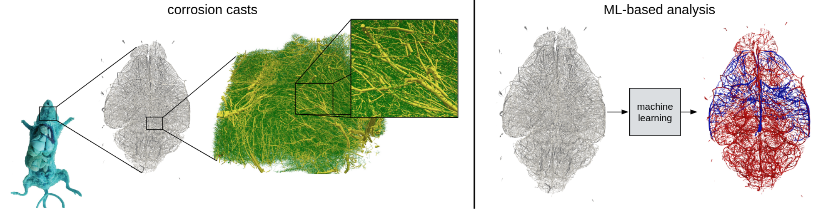

This project is hosted at the [Biomedical Image Analysis and Machine Learning Lab](https://www.dqbm.uzh.ch/en/research/menze.html) of the University of Zurich.
More/additional information can be found [here](https://sirop.org/app/0b221f43-5aab-45f9-bb4b-356bc02f1741?_k=57ZsvsWXAtEilbQA). The project can also be carried out remotely.

    

### Background:
The brain is one of the most complex organs in the human body. Its proper functioning relies heavily on a vast network of blood vessels
known as the brain vasculature. The brain vasculature is not only responsible for delivering oxygen and nutrients to the brain's neurons
and removing waste products but also plays a critical role in regulating cerebral blood flow and maintaining the blood-brain barrier.
Therefore, obtaining a deeper understanding of the brain vasculature's structure and function is essential to study human intelligence
and to gain insights into various neurological disorders, such as stroke, dementia, and brain tumors. Recent advances in imaging
technologies [1, 3, 4, 5] have enabled researchers to study the whole brain vasculature in unprecedented detail. In this context, a
promising approach is represented by transforming brain vasculature into graph-structured data [2] consisting of blood vessels (edges)
and their bifurcation points (vertices).

### Aim:
The aim of this project is to use and develop novel (potentially ML-based) algorithms to obtain a deeper understanding of the graph-structured vasculature preserved in corrosion casts [1]. 
To this end, potential projects include whole-brain quantitative analysis, graph neural networks, label propagation, and/or novel graph-based clustering approaches [2, 3].
A nice starting point would be to explore weakly supervised label propagation approaches (see following [ICLR paper](https://arxiv.org/abs/2210.03594)).
The aim should also be to contribute to a scientific publication.

### Your qualifications:
1. Knowledge of common machine learning and network analysis practices
2. Excellent programming skills in Python as well as familiarity with PyTorch and NetworkX (or similar libraries)
3. Full time commitment towards the completion of your project
4. Ability to work independently on challenging projects
5. Prior knowledge in neuroscience and computer science is advantageous

### What we offer:
- The opportunity to join an ongoing project [1] with real-world medical impact
- Potential transition into a PhD project
- The possibility to bring in your own ideas and combine them with state-of-the-art algorithms
- Close supervision by an interdisciplinary team of experts
- The opportunity to visit our lab in Zurich

### How to apply:
​Please send your CV and transcript to Johannes Paetzold (johannes.paetzold@tum.de) and Bastian Wittmann (bastian.wittmann@uzh.ch).
Links to previous work (e.g., your GitHub profile) are highly appreciated.
​
### References:
​[1] Wälchli et al. "Hierarchical imaging and computational analysis of 3D vascular network architecture in the entire postnatal and adult mouse brain," Nature Protocols, 2021

[2] Paetzold et al. "Whole brain vessel graphs: A dataset and benchmark for graph learning and neuroscience," Conference on Neural Information Processing Systems, 2021

[3] Todorov et al. "Machine learning analysis of whole mouse brain vasculature," Nature Methods, 2020

[4] Wälchli et al. "Nogo-A regulates vascular network architecture in the postnatal brain," Journal of Cerebral Blood Flow & Metabolism, 2017

[5] Wälchli et al. "Shaping the brain vasculature in development and disease in the single-cell era," Nature Reviews Neuroscience, 2023