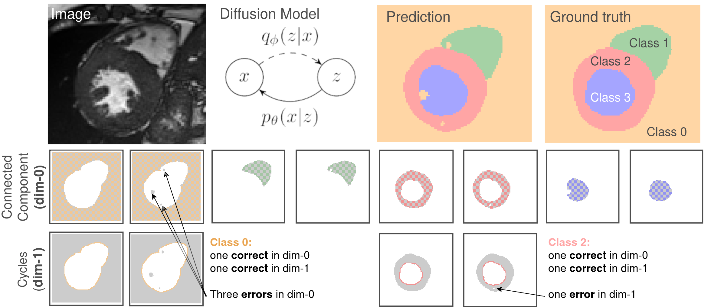

This project can be hosted in Munich and/or Zurich @Biomedical Image Analysis & Machine Learning Group,
University of Zurich.

### Background:
Topology is vital in medical image segmentation, emphasizing anatomically correct structures & removing incorrect ones. Previous works [1-3] explored how to enforce topological constraints, however, are applied only at training. Recent diffusion-based models [4, 5] offer a novel way to enforce topological constraints during inference.

### Your tasks: 
First, you will develop a diffusion model for segmentation. Next, you will be devising a novel way to integrate topological constraints in the diffusion model. Importantly, we aim to publish the results of this work with you at a high-impact conference or journal.

### Your qualifications:
We are looking for a highly motivated Master’s student in CS, Physics, Engineering or Mathematics with
*  Good understanding and strong interest in SOTA generative models.
*  Advanced programming skills in Python and common DL framework, i.e., PyTorch.
* Strong interest in teamwork and inter-disciplinary research.

### What we offer:
- The opportunity to join an ongoing project with the aim of publishing a top tier conference paper.
- An exciting research project with many possibilities to bring in your own ideas.
- Potential transition into a PhD project.
- The possibility to bring in your own ideas and combine them with state-of-the-art algorithms.
- Close supervision by an interdisciplinary team of experts in computer vision, and deep learning.
- Access to state-of-the-art computer hardware.

### How to apply:
​Please send your CV and transcript to Johannes Paetzold (johannes.paetzold@tum.de) and Suprosanna Shit (suprosanna.shit@uzh.ch).
Links to previous work (e.g., your GitHub profile) are highly appreciated.
​
### References:
​[1] Stucki et al. Betti-matching, ICML 2023
[2] Gupta et al. Topology Interactions, ECCV 2022
[3] Berger et al. Multi-class Betti Matching, arxiv, 2024
[4] Wu et al. MedSegDiff-V2, AAAI 2024
[5] Song et al. Loss-guided Diffusion, ICML 2023
