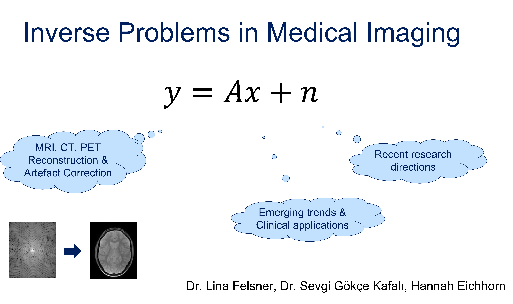

More information will be provided during an introduction meeting scheduled at 10/02/2025 at 10am via Zoom:
- https://tum-conf.zoom-x.de/j/63305971488?pwd=VdbDeahxywbJSmpBuDlvNxjNW1BLbj.1, Meeting ID: 633 0597 1488 Passcode: 684506

In medical imaging, the reconstruction of high-quality images from incomplete or corrupted data often involves solving inverse problems. Deep learning has emerged as a powerful tool for addressing these challenges, offering approaches to improve image reconstruction quality, enhance computational efficiency, and tackle complex non-linearities. 
This seminar explores the concepts of deep learning for inverse problems, focusing on their applications in medical imaging. Selected materials from recent methodological advances will be covered as well as key challenges and opportunities in leveraging deep learning for clinical applications.

Key topics to be covered include:
* Introduction to inverse problems in medical imaging
* Deep learning approaches for solving inverse problems
* Applications in various medical imaging modalities (e.g., MRI, CT, PET)
* Comparison of traditional and deep learning-based methods
* Emerging trends and clinical implications

Please register at: https://matching.in.tum.de/ or write an e-mail to hannah.eichhorn@tum.de, lina.felsner@tum.de or s.kafali@tum.de.

Check the intro slides here:

[Seminar slides](InvPr_seminar.pdf)

